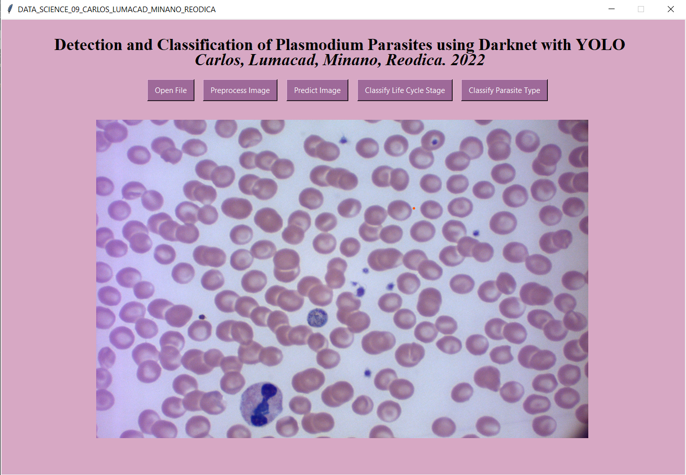
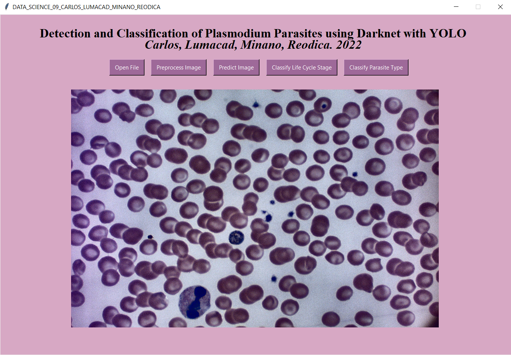
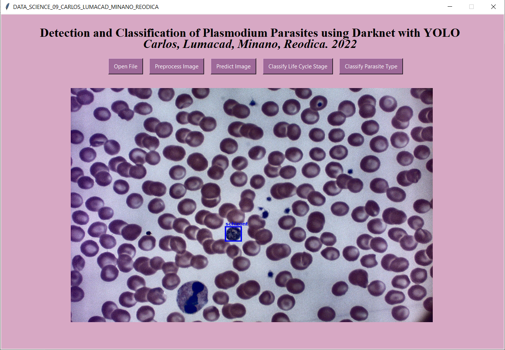
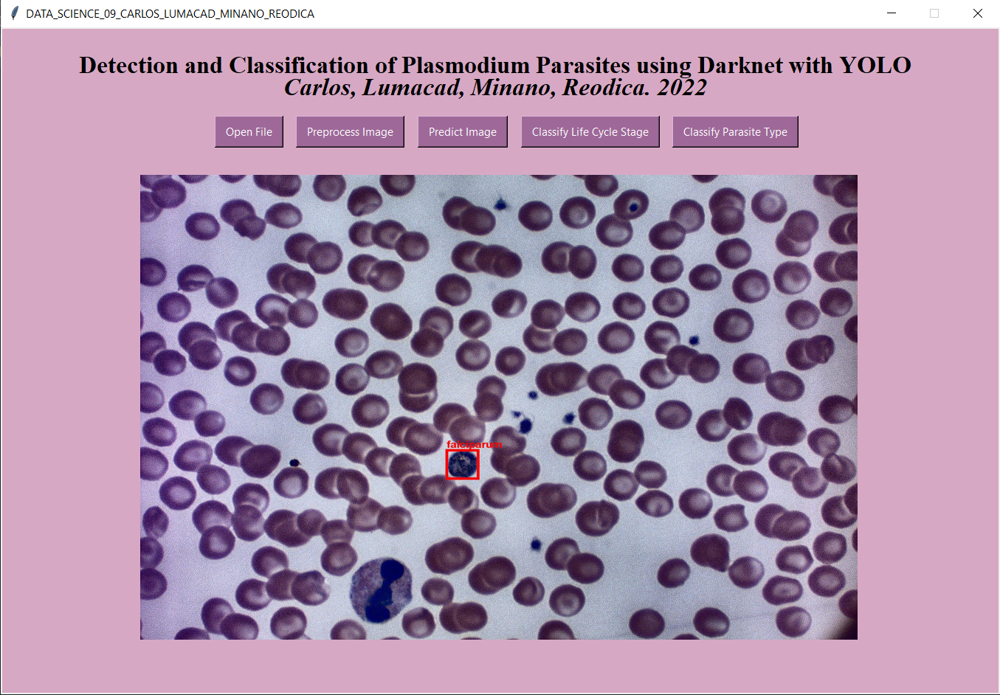

# Detection and Classification of Malaria Parasites in Human Blood Smear Images using DarkNet with YOLO

This repository holds the program that we created from our Thesis project. The program is used to detect the malaria-infected red blood cells within a human blood smear image, and then classify the cells further according to their parasite-type and life-cycle stage. It was able to achieved 98.71% accuracy using YOLOv4 for the detection, and 97.08% for parasite type and 97.36% for life-cycle stage classification using Darknet53. In comparison with our basis study, it was able to beat U-Net with VGG16 as it was only able to achieve 96.50% accuracy using U-Net for the detection, and 92.68% for parasite type and 88.96% for life-cycle stage classification using VGG16

## Documentation

Further information about the thesis' documentation and methodology can be found in our research paper in the following link: <a href="https://drive.google.com/file/d/1ZDRTkyTD1fsCDISOs69X4qhW8peGArmB/view?usp=share_link">Research Paper</a>

## Program Installation
The program allows the user to detect the malaria-infected cells within an input blood smear image and then classify each of the infected cells according to their
parasite type and life-cycle stage. To run the program, the following procedures must be followed:

1. Follow the procedures in the following link to install the darknet framework and its prerequisites: <a href="https://github.com/AlexeyAB/darknet#requirements-for-windows-linux-and-macos">Procedures</a>
2. Create a folder named “Program” in your darknet-master directory
3. Clone or download this repository in the “Program” folder
4. Create a folder named “Dataset” within the “Program” folder
5. Download the dataset from the following drive link and then place it in the “Dataset” folder:
<a href="https://drive.google.com/drive/folders/1QIiNiC-z_UnMNN55nFi1OFRWlIPxAbzH">Dataset</a>
6. Create a folder named “Weights” within the “Program” folder
7. Download the weights for YOLOv4 and Darknet53 from the following drive link and then place it in the “Weights” folder:
<a href="https://drive.google.com/drive/folders/1knAU8cNAYGPqw0Gqdpo4r47nLRg3q_jN">Weights</a>
8. Open up the command prompt in the “Program” folder and then launch the program by typing the line:
### `python DATASCI09_GUI.py`
10. After the program launches, the user may now detect and classify the malaria-infected cells within an input image.

## Screenshots of the Program
1. After inputting images

2. After preprocessing

3. After infected-cell detection

4. After life-cycle stage classification

5. After parasite type classification

